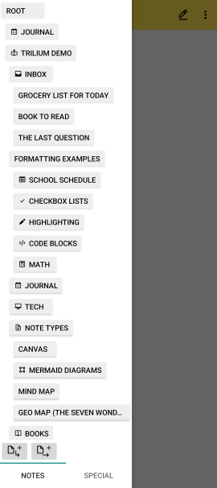
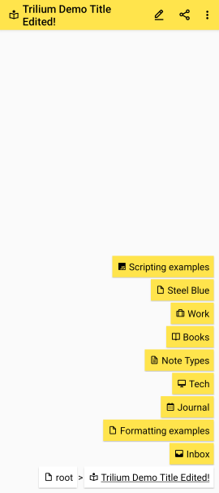

# Trilium Notes for Android  

Unofficial port of [TriliumNext Notes](https://github.com/TriliumNext/Notes) to Android.

## Features

- Synchronisation with sync server / desktop app
- Notes can be arranged into arbitrarily deep tree, where single notes can be placed into multiple places in the tree
- WYSIWYG note editor based on [AztecEditor](https://github.com/wordpress-mobile/AztecEditor-Android/)
- Fast and easy navigation between notes
- Automatic note versioning
- Note attributes and relations for organization, querying and advanced scripting
- Note encryption with per-note granularity
- Canvas notes powered by [Excalidraw](https://excalidraw.com/)
- Note map view (context-based / all notes)
- Scripting API to automate tasks or send notifications

More features are planned, see the [issue tracker](https://github.com/FliegendeWurst/TriliumDroid/issues?q=sort%3Aupdated-desc%20is%3Aissue%20is%3Aopen%20label%3Aenhancement) for a full list.

### Android integration

- Note content can be shared to other apps
- Received shared content is saved as new note
- Translated UI: English, German, Turkish, Chinese (Simplified Han script)
- Light/Dark Theme following system preference

### Requirements

- Sync server running TriliumNext/Trilium (any version from 0.93.0 to 0.63.7)
- Android 7.0+

For using the app without a sync server, follow [this issue](https://github.com/FliegendeWurst/TriliumDroid/issues/75).  
If you're still using Android 6.0 or older, see [this issue](https://github.com/FliegendeWurst/TriliumDroid/issues/72).  
For other ways to use Trilium on mobile, see https://github.com/TriliumNext/Notes/issues/72.

## Screenshots

| Note tree  | Full-screen navigation | Note icon selection | Jump-to-note dialog |
| ------------- | ------------- | --- | --- |
|  |  |  |  |
| sub-trees are collapsible | | [boxicons](https://boxicons.com/) | |

## Installation

If you already have [F-Droid](https://f-droid.org/) installed, you can add [IzzyOnDroid's F-Droid repository](https://apt.izzysoft.de/fdroid/) in F-Droid's settings. Then install the app like any other.

Or if you prefer to install the app directly:

1. Download the APK from [IzzyOnDroid](https://apt.izzysoft.de/fdroid/index/apk/eu.fliegendewurst.triliumdroid).
2. Install the APK. You need to enable installing apps from unknown sources.
3. Open the app and configure your sync server (hostname, port, password).
4. Go back, wait until sync is finished.

Several parts of the user interface are configurable, check the app settings for more details.
To edit notes, use the edit button in the toolbar.

## Contribute

Please report bugs and missing features. Translations are done via [Weblate](https://hosted.weblate.org/projects/triliumdroid/app/).

If you're any good at Android app development using Kotlin, feel free to contribute code :)

### Testing

- `app/test/setup-test-server.sh`
- Gradle action `pixel9api35DebugAndroidTest`
- `app/test/compare-test-images.sh`

## License

Copyright © 2023 Arne Keller

This program is free software: you can redistribute it and/or modify
it under the terms of the GNU Affero General Public License as published by
the Free Software Foundation, either version 3 of the License, or
(at your option) any later version.

This program is distributed in the hope that it will be useful,
but WITHOUT ANY WARRANTY; without even the implied warranty of
MERCHANTABILITY or FITNESS FOR A PARTICULAR PURPOSE.  See the
GNU Affero General Public License for more details.

You should have received a copy of the GNU Affero General Public License
along with this program.  If not, see <https://www.gnu.org/licenses/>.

Parts of this program are derived from zadam's [Trilium Notes](https://github.com/zadam/trilium/), the AGPL-3.0 applies.  
Parts of this program are derived from Elian Doran's [TriliumNext Notes](https://github.com/TriliumNext/Notes), the AGPL-3.0 applies.  
The MIT License applies to the [boxicons](https://boxicons.com/) included in the project (see `boxicons_LICENSE.txt`).  
The GPL-3.0 license applies to the styles derived from [Simple-Commons](https://github.com/SimpleMobileTools/Simple-Commons).  
The MIT license applies to the bundled [excalidraw](https://github.com/excalidraw/excalidraw) (see license notices in `app/src/main/assets/web.zip`).  
The GPL-2.0 (or later) license applies to the included [CKEditor](https://github.com/ckeditor/ckeditor5) (`app/src/main/assets/ckeditor.js`).  
For other included libraries, their respective license applies.  
